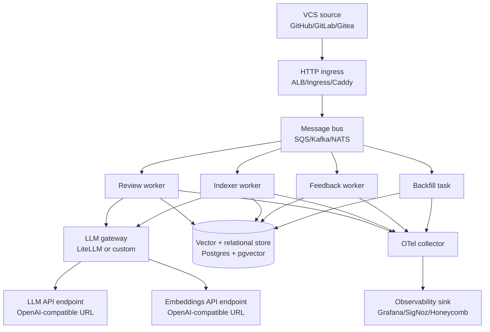

# Code Review System — Design Specification

**Status:** Design, ready for implementation
**Audience:** Claude Code (primary) and human engineers
**Last updated:** May 2026

This document is the source of truth for implementation. Anything not specified here is an open question and should be raised before code is written. Every infrastructure component is a plug slot — the application depends on the contract, not the implementation.

---

## 1. Purpose

An AI-assisted code review system for a ~35-developer team at a regulated aviation software company. It posts inline comments, a summary review, and a required status check on every PR; learns from accepted versus dismissed feedback over time; and is built so any infrastructure piece can be swapped without touching application code.

Two non-negotiables drive every design decision: **unit cost per PR review**, and **data privacy** (control over where customer code is allowed to travel).

## 2. Goals and non-goals

**Goals**
1. Catch real bugs and security issues humans miss
2. Enforce team conventions consistently across all repos
3. Reduce reviewer toil on style and nit comments
4. Learn from human feedback so false positives drop over time
5. Stay infrastructure-pluggable — application code does not know whether the LLM endpoint is Bedrock, a hosted vendor, or a self-hosted GPU

**Non-goals**
- Replacing human code review (this is a first-pass reviewer)
- Generating fix PRs from the bot
- Replacing traditional static analysis (linters and SAST tools run alongside, not inside, this system)
- GitHub Enterprise Server support in v1 (Cloud only; design accommodates the change later)

## 3. Constraints

| Constraint | Implication |
|---|---|
| TypeScript/JavaScript-dominant codebase | tree-sitter parsers for `ts`, `tsx`, `js`, `jsx`, `json` are required; other languages added incrementally |
| GitHub Cloud as VCS | GitHub App with installation tokens; subscribe to `pull_request`, `pull_request_review_comment`, `push`, `check_run`, `reaction` events |
| Regulated aviation context | KMS-encrypted storage, audit log of every LLM call, SOC 2 evidence trail reconstructable from `pr_runs` + traces |
| Cost ceiling indicative ~$300/mo at scale | Retrieval-augmented prompts keep tokens bounded; cheaper-model fallback path required |
| Pluggable infrastructure | Every external dependency behind an interface; deployment manifest picks the implementation |
| IaC-managed | No console clicks; Terraform (or Pulumi) provisions everything |

## 4. Architecture overview



The system has twelve plug slots:

| Slot | Contract | Pilot default |
|---|---|---|
| VCS source | Webhook + REST for diffs, comments, checks | GitHub Cloud (GitHub App) |
| HTTP ingress | HTTPS listener with HMAC validation | ALB on Fargate |
| Message bus | Publish + consume + retries + DLQ | SQS |
| Worker runtime | OCI container, env-var config, OIDC for cloud auth | Fargate |
| LLM gateway | OpenAI chat completions + embeddings; server-side retry, fallback, spend tracking | LiteLLM proxy |
| Vector + relational store | Postgres URL with pgvector extension | RDS Postgres single-AZ |
| OTel collector | OTLP receiver | OpenTelemetry Collector (contrib distro) |
| Observability sink | OTLP receiver | Grafana Cloud (free tier) |
| LLM endpoint | OpenAI chat completions URL | Set at deploy time |
| Embeddings endpoint | OpenAI embeddings URL | Set at deploy time |
| Egress path | Outbound TCP+TLS to internet or peer | NAT Gateway, 1 AZ |
| Secrets | Env-var-injected at task start | AWS Secrets Manager + KMS CMK |

Three deployment profiles ship as separate Terraform workspaces. Application code is identical across all three:

1. **lean-self-hosted** — single EC2, embedded NATS, self-hosted PG, OTLP → stdout or local SigNoz
2. **cloud-portable** — Aurora Serverless v2 or RDS, SQS, ALB, Grafana Cloud free
3. **aviation-compliance** — multi-AZ RDS with KMS CMK, VPC endpoints, AWS Managed Prom + Grafana, NAT in 2 AZs

## 5. Data model

PostgreSQL 16+ with `pgvector` and `pg_trgm` extensions. All tables carry `tenant_id` from day one (single default tenant in the pilot).

```sql
CREATE EXTENSION IF NOT EXISTS vector;
CREATE EXTENSION IF NOT EXISTS pg_trgm;

CREATE TABLE tenants (
  tenant_id   UUID PRIMARY KEY,
  name        TEXT NOT NULL,
  created_at  TIMESTAMPTZ DEFAULT now()
);

CREATE TABLE repos (
  repo_id              UUID PRIMARY KEY,
  tenant_id            UUID NOT NULL REFERENCES tenants,
  owner                TEXT NOT NULL,
  name                 TEXT NOT NULL,
  default_branch       TEXT NOT NULL,
  indexed_commit_sha   TEXT,
  backfill_window_days INT  DEFAULT 270,    -- 9 months, per-repo overridable
  enabled              BOOL DEFAULT true,
  UNIQUE (owner, name)
);

CREATE TABLE code_chunks (
  chunk_id         UUID PRIMARY KEY,
  tenant_id        UUID NOT NULL,
  repo_id          UUID NOT NULL REFERENCES repos,
  file_path        TEXT NOT NULL,
  symbol_name      TEXT,
  symbol_kind      TEXT,                    -- function | class | method | interface | type
  start_line       INT, end_line INT,
  content          TEXT NOT NULL,
  content_hash     TEXT NOT NULL,           -- skip re-embed when unchanged
  commit_sha       TEXT NOT NULL,
  embedding        vector(1024),
  last_indexed_at  TIMESTAMPTZ DEFAULT now()
);
CREATE INDEX code_chunks_embedding_idx ON code_chunks USING hnsw (embedding vector_cosine_ops);
CREATE INDEX code_chunks_locator_idx   ON code_chunks (tenant_id, repo_id, file_path);

CREATE TABLE review_comments (
  comment_id       UUID PRIMARY KEY,
  tenant_id        UUID NOT NULL,
  repo_id          UUID NOT NULL,
  pr_number        INT NOT NULL,
  source           TEXT NOT NULL,            -- 'bot' | 'human'
  github_id        BIGINT,                   -- nullable for bot-only-not-yet-posted; UNIQUE when present
  file_path        TEXT, start_line INT, end_line INT,
  diff_hunk        TEXT,
  comment_text     TEXT NOT NULL,
  category         TEXT,                     -- bug | security | style | suggestion | question
  outcome          TEXT,                     -- accepted | dismissed | discussed | pending
  outcome_signal   TEXT,                     -- implicit-line-changed | thumbs-up | thumbs-down | replied
  embedding        vector(1024),
  created_at       TIMESTAMPTZ DEFAULT now(),
  resolved_at      TIMESTAMPTZ
);
CREATE UNIQUE INDEX review_comments_github_id_idx ON review_comments (github_id) WHERE github_id IS NOT NULL;
CREATE INDEX review_comments_embedding_idx       ON review_comments USING hnsw (embedding vector_cosine_ops);
CREATE INDEX review_comments_outcome_idx         ON review_comments (tenant_id, outcome);

CREATE TABLE rules (
  rule_id        UUID PRIMARY KEY,
  tenant_id      UUID NOT NULL,
  scope          TEXT NOT NULL,             -- '*' | 'repo:foo' | 'path:**/*.sql'
  title          TEXT NOT NULL,
  description    TEXT NOT NULL,
  source_commit  TEXT,                      -- git provenance from rules repo
  embedding      vector(1024),
  enabled        BOOL DEFAULT true,
  updated_at     TIMESTAMPTZ DEFAULT now()
);
CREATE INDEX rules_embedding_idx ON rules USING hnsw (embedding vector_cosine_ops);

CREATE TABLE pr_runs (
  run_id         UUID PRIMARY KEY,
  tenant_id      UUID NOT NULL,
  repo_id        UUID NOT NULL,
  pr_number      INT NOT NULL,
  head_sha       TEXT NOT NULL,
  trigger        TEXT NOT NULL,             -- pr-opened | pr-updated | slash-command | manual
  model_used     TEXT,                      -- 'primary' | 'fallback'
  tokens_in      INT, tokens_out INT,
  cost_usd       NUMERIC(10,4),
  status         TEXT NOT NULL,             -- pending | posted | failed-open | budget-exceeded
  started_at     TIMESTAMPTZ DEFAULT now(),
  finished_at    TIMESTAMPTZ
);
CREATE INDEX pr_runs_lookup_idx ON pr_runs (tenant_id, repo_id, pr_number, started_at DESC);

CREATE TABLE feedback_events (
  event_id     UUID PRIMARY KEY,
  tenant_id    UUID NOT NULL,
  comment_id   UUID NOT NULL REFERENCES review_comments,
  signal       TEXT NOT NULL,                -- line-changed | thumbs-up | thumbs-down | replied | dismissed
  observed_at  TIMESTAMPTZ DEFAULT now()
);

CREATE TABLE cost_caps (
  tenant_id        UUID NOT NULL,
  repo_id          UUID,                     -- NULL = tenant default
  daily_usd_cap    NUMERIC(10,2) DEFAULT 5.00,
  per_pr_token_cap INT DEFAULT 30000,
  PRIMARY KEY (tenant_id, repo_id)
);
```

## 6. Pipelines

### 6.1 Review pipeline (per PR)

Trigger: `pull_request.opened`, `pull_request.synchronize`, `pull_request_review_comment.created` (for slash commands), or manual replay.

1. Webhook gateway receives event, validates HMAC, enqueues to `review-jobs` with idempotency key `${repo_id}:${pr_number}:${head_sha}`
2. Worker pulls job, consults `cost_caps`; if exceeded, mark `pr_runs.status='budget-exceeded'`, post neutral comment, exit
3. Fetch unified diff from GitHub REST API at `head_sha`
4. Embed diff hunks (chunked by file) via LLM gateway → embeddings endpoint
5. Retrieve from `code_chunks`: top-K (default 15) related symbols via vector cosine, with same-file proximity boost
6. Retrieve from `review_comments`: top-K (default 8) past comments on semantically similar code, weighted by outcome (accepted +2, discussed 0, dismissed −2)
7. Retrieve from `rules`: all enabled rules whose scope matches the changed files
8. Assemble prompt (template in Appendix A); enforce ≤ `per_pr_token_cap`
9. Call LLM gateway with primary model; on failure retry 3× with exponential backoff; on persistent failure switch to fallback model URL; if both fail, set `pr_runs.status='failed-open'` and post a neutral comment
10. Parse response as strict JSON; reject any comment that doesn't cite a specific line range in the diff
11. Post via GitHub Reviews API as a single review (inline comments + summary body)
12. Update the check run for `head_sha` — success unless any comment has `category in ('bug','security')`
13. Insert `pr_runs` row with token counts and cost

### 6.2 Indexing pipeline (per push to default branch)

Trigger: `push` event where `ref == refs/heads/${default_branch}`.

1. Webhook gateway enqueues to `index-jobs`
2. Indexer worker pulls job, reads `repos.indexed_commit_sha`
3. Compute `git diff --name-status ${last_sha} ${head_sha}` via GitHub REST
4. For each changed file with a supported extension:
   - Fetch full content at `head_sha`
   - Parse with tree-sitter, split by function / class / exported-symbol boundary
   - Compute SHA-256 of each chunk's normalized content
   - For chunks where `content_hash` matches an existing row: update `commit_sha` and `last_indexed_at` only; skip embedding (cheap path)
   - For new or changed chunks: embed via LLM gateway → embeddings endpoint; upsert into `code_chunks`
5. Soft-delete rows for files no longer present (retain 30 days for time-travel queries)
6. Update `repos.indexed_commit_sha = head_sha`

### 6.3 Feedback pipeline (continuous)

Triggers: `pull_request_review_comment.created`, `.edited`, `reaction.created`, `pull_request.closed`.

1. For each bot comment, when a new commit lands on the same PR:
   - Diff the new commit against the prior one
   - If the line range in the comment was modified → outcome `accepted`, signal `implicit-line-changed`
   - Else if PR merged with no replies or reactions → outcome `dismissed`
   - Else if there are replies → outcome `discussed`
2. Thumbs reactions on bot comments → `outcome_signal = 'thumbs-up'` or `'thumbs-down'`, outcome `accepted` or `dismissed`
3. All signals append to `feedback_events`; the most recent signal updates `review_comments.outcome` and `outcome_signal`

### 6.4 Backfill pipeline (one-shot, idempotent, configurable window)

Trigger: manual CLI or admin API; parameters: `repo_id`, `window_days` (default `repos.backfill_window_days`).

1. Compute cutoff date = `now - window_days`
2. Page through GitHub Search API: `is:pr is:closed merged:>=${cutoff_date}` for the repo
3. For each PR:
   - Fetch all review comments via GitHub API
   - For each comment, fetch the diff hunk at the comment's `commit_id`
   - Determine outcome by inspecting subsequent commits on the PR (same logic as feedback pipeline)
4. Upsert into `review_comments` with `source='human'`; the `UNIQUE` index on `github_id` provides idempotency
5. Embed `(comment_text || diff_hunk)` via embeddings endpoint
6. Re-running with a larger `window_days` extends the history without duplicating rows. Reducing the window is a no-op (rows are not deleted).

### 6.5 Rules sync pipeline

Trigger: `push` to `${rules_repo}` on `${default_branch}`.

1. Lambda (or equivalent) clones rules repo, parses `rules/**/*.md`
2. Each file maps to one `rules` row; YAML front-matter provides `scope`, `category`, `severity`, `title`
3. Compute embedding of `(title || description)`
4. Upsert by `(source_commit, file_path)`; tombstone removed rules (`enabled=false`)

## 7. Prompt assembly

The review worker constructs a single user-turn prompt with these sections in order:

1. **System** (~500 tokens) — role, output schema (strict JSON), team conventions summary
2. **Diff** (variable, capped ~5k tokens) — unified diff for the PR
3. **Related code** (~3k tokens) — top-K code chunks retrieved by diff embedding similarity
4. **Past reviews** (~2k tokens) — up to 8 similar past comments with `[ACCEPTED]` / `[DISMISSED]` / `[DISCUSSED]` annotations
5. **Applicable rules** (~1k tokens) — scope-matched rules
6. **Closing instruction** (~200 tokens) — emit a JSON array only

Total input budget: `per_pr_token_cap` (default 30k). When the budget is tight, drop in this order: past reviews → related code → rules. **The diff is never trimmed.** If the diff alone exceeds budget, chunk the diff by file and run multiple reviews, then merge results before posting.

## 8. PR integration

GitHub events subscribed: `pull_request`, `pull_request_review_comment`, `push`, `check_run`, `reaction`.

**Comment surfaces:**
- **Inline comments** on specific line ranges via Reviews API
- **Summary body** on the review object with overall verdict
- **Status check** named `code-review-bot/review` — success unless `category in ('bug','security')` comments fire
- **Slash commands** in PR comments:
  - `/review` — re-run review against current head
  - `/improve` — emit refactor suggestions only (`category='suggestion'`)
  - `/ask <question>` — Q&A over the diff, posted as a single comment

**Failure modes:**
| Mode | Behavior |
|---|---|
| LLM primary fails | Retry 3× with exponential backoff (1s, 2s, 4s) |
| All retries fail | Switch to fallback model URL |
| Fallback also fails | `pr_runs.status='failed-open'`; post neutral comment; check passes |
| Budget exceeded | `pr_runs.status='budget-exceeded'`; post neutral comment; check passes |
| Webhook signature invalid | Reject with 401; do not enqueue; emit security audit event |

## 9. Configuration

Single TOML file per deployment, plus secrets injected as env vars. Slots are filled by URL or connection string:

```toml
[vcs]
provider       = "github"
app_id         = "${GITHUB_APP_ID}"
private_key    = "${GITHUB_APP_PRIVATE_KEY}"
webhook_secret = "${GITHUB_WEBHOOK_SECRET}"

[message_bus]
type              = "sqs"                    # sqs | kafka | nats | redis-streams
review_queue_url  = "${REVIEW_QUEUE_URL}"
index_queue_url   = "${INDEX_QUEUE_URL}"
feedback_queue_url= "${FEEDBACK_QUEUE_URL}"

[store]
postgres_url      = "${POSTGRES_URL}"        # any pgvector-enabled PG

[llm]
gateway_url           = "http://litellm:4000"
primary_model_url     = "${LLM_PRIMARY_URL}"    # OpenAI-compatible
fallback_model_url    = "${LLM_FALLBACK_URL}"
embeddings_url        = "${EMBEDDINGS_URL}"
api_key               = "${LLM_API_KEY}"
per_pr_token_cap      = 30000

[cost]
daily_usd_cap_default = 5.00

[observability]
otlp_endpoint = "${OTLP_ENDPOINT}"           # OTel Collector
service_name  = "code-review-system"

[rules]
git_url = "${RULES_REPO_URL}"
branch  = "main"
```

Per-repo overrides live in `repos.backfill_window_days` and `cost_caps` rows; no extra YAML.

## 10. Observability

Emit OTLP from every component. Required metrics:

| Metric | Type | Labels |
|---|---|---|
| `review.pr.received` | counter | repo, event_type |
| `review.pr.completed` | counter | repo, status |
| `review.duration_seconds` | histogram | repo, model_used |
| `review.tokens_in`, `tokens_out` | histogram | repo, model |
| `review.cost_usd` | counter | repo, model |
| `index.chunks_embedded` | counter | repo |
| `feedback.outcome_recorded` | counter | outcome |
| `llm.request_latency_seconds` | histogram | model_url, endpoint_kind |
| `llm.errors` | counter | model_url, error_class |

Required spans: every webhook → review pipeline as a single trace; every LLM call as a child span with `model_url` and token counts as attributes; every Postgres query.

Logs: structured JSON, one log per LLM request with **redacted** body (token counts and timing only), full audit trail of every comment posted.

## 11. Security and privacy

- **Webhook ingestion** validates GitHub HMAC SHA-256 signature; bad signature returns 401 and is never enqueued
- **Secrets** never logged; values come from Secrets Manager / Vault / KMS-encrypted env vars
- **TLS in transit** end-to-end, including DB connection (`sslmode=verify-full`)
- **Encryption at rest** via KMS CMK on the Postgres volume
- **Egress** to LLM and embeddings endpoints only from worker subnets; egress path is pluggable (NAT, IGW + SG allowlist, VPC peering, on-prem VPN)
- **No payload logging** — diffs and code chunks never appear in logs; only structured metadata
- **Audit log** — every `pr_runs` row and every LLM request span is the audit trail; 12-month minimum retention
- **Right to delete** — disabling a repo tombstones all `code_chunks`, `review_comments`, and `pr_runs` for that repo

## 12. Cost targets and caps

| Profile | Pilot (3 repos, 30 PR/mo) | Scale (30 repos, 300 PR/mo) |
|---|---|---|
| lean-self-hosted | ~$40/mo | ~$90/mo |
| cloud-portable | ~$120/mo | ~$280/mo |
| aviation-compliance | ~$150/mo | ~$370/mo |

Defaults: `$5/repo/day` hard cap, `30,000 tokens` per PR input cap. Caps are enforced by the review worker before the LLM call; exceeded caps mark the run and post a neutral comment, the check still passes.

## 13. Rollout

| Week | Milestone |
|---|---|
| 1 | Terraform skeleton + Postgres + Secrets Manager. Webhook gateway receives but only logs. GitHub App registered. |
| 2 | Indexer pipeline end-to-end. 3 pilot repos fully indexed. LLM gateway live, calling configured endpoints. |
| 3 | Review pipeline naive (no memory yet). Bot posts inline + summary + status check on pilot PRs. Measure baseline cost. |
| 4 | Backfill job runs (9-month window). Experience memory populated. Retrieval wired into prompt. Measure quality + cost delta. |
| 5 | Rules repo bootstrapped (~20 starter rules). Rules sync live. Both git source-of-truth + DB cache working. |
| 6 | Feedback collector live. Implicit + explicit signal capture. Observability dashboard live. Decision point on expansion. |

## 14. Acceptance criteria

A repo is "ready for production" when:

- [ ] Indexing completes within 30 min from cold start, < 5 min on incremental
- [ ] 95th-percentile review latency < 4 min wall-clock per PR
- [ ] Bot posts at least one substantive comment on 95% of PRs with ≥ 50 lines changed
- [ ] False positive rate (thumbs-down + dismiss) below 25% after 4 weeks of feedback
- [ ] Cost per PR review below $0.20 at pilot, below $0.10 at scale (with retrieval working)
- [ ] No webhook event is lost during a planned worker restart
- [ ] Audit query "show every LLM request made for repo X on date Y" returns a complete list
- [ ] Failover: pulling the primary LLM URL causes traffic to shift to fallback within 30s, then to fail-open within another 30s

## 15. Open questions

- GitHub App vs. GitHub Enterprise OAuth — App preferred; confirm before registration
- Read existing human reviewer comments on the active PR as additional prompt context? Default: yes. Flag if signal quality drops.
- Retention of full LLM request/response payloads — 90 days vs 12 months — pending compliance team input
- Allow GitHub `suggestion` blocks in bot comments? Default: no in v1, revisit after pilot.
- Fallback model — same-vendor variant or different-vendor for true HA? Default: same-vendor for simplicity.

---

## Appendix A — Prompt template

```
You are a senior engineer reviewing a pull request.
You will receive: a unified diff, related code from the same repository,
past review comments with their outcomes, and applicable team rules.

Output ONLY a JSON array of comment objects with this exact shape:
  [{"file": "...", "start_line": N, "end_line": N, "comment": "...",
    "category": "bug|security|style|suggestion|question",
    "severity": "high|medium|low"}]

Rules for output:
- Cite exact line numbers from the diff. Never invent lines.
- Skip nits the team has previously dismissed (severity=low + dismissed pattern).
- Prefer questions over assertions when uncertain.
- Limit total comments to 8 per PR; pick the highest-severity findings.

[DIFF]
${diff}

[RELATED CODE]
${related_code_chunks}

[PAST REVIEWS — with outcomes]
${past_comments_annotated}

[APPLICABLE RULES]
${rules}
```

## Appendix B — Rule file format

```markdown
---
scope: "path:**/*.sql"
category: security
severity: high
title: SQL migrations must include a down migration
---

Every file under `migrations/` must export both `up` and `down` functions.
Migrations without a `down` block break the rollback procedure documented in
runbook RB-014 and prevent emergency reverts. Flag any new `.sql` or `.ts`
migration file missing a `down` export.
```

## Appendix C — GitHub App permission set (minimum)

- **Repository permissions:** Contents (read), Pull requests (read+write), Checks (read+write), Metadata (read)
- **Subscribe to events:** pull_request, pull_request_review_comment, push, check_run, reaction
- **Webhook URL:** `${INGRESS_URL}/github/webhook`
- **Webhook secret:** per-environment

## Appendix D — Deployment profiles

Each profile is a separate Terraform workspace under `infra/profiles/`. Application code is identical; only the slot implementations differ.

| Slot | lean-self-hosted | cloud-portable | aviation-compliance |
|---|---|---|---|
| Worker runtime | Docker on EC2 t4g.medium | Fargate | Fargate, multi-AZ |
| Message bus | NATS embedded | SQS | SQS |
| Store | Self-hosted PG on same EC2 | RDS or Aurora Serverless v2 | Multi-AZ RDS, KMS CMK |
| Ingress | Caddy on host | ALB | ALB, WAF attached |
| Egress | IGW + SG | 1 NAT Gateway | 2 NAT Gateways + VPC endpoints |
| Observability sink | Local SigNoz container | Grafana Cloud free | AWS Managed Prom + Grafana |
| Secrets | SOPS + age | Secrets Manager | Secrets Manager + CMK |
